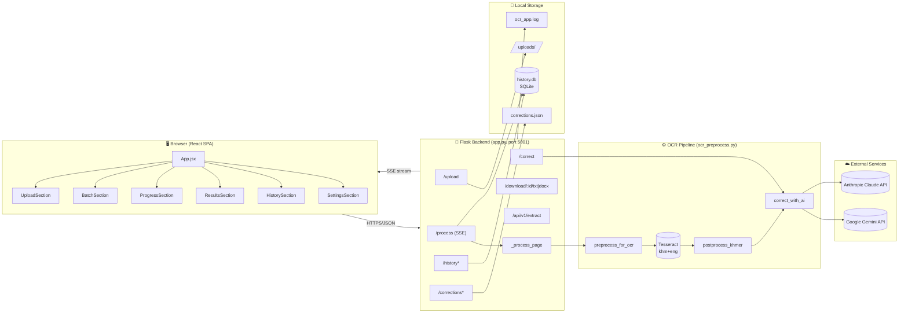
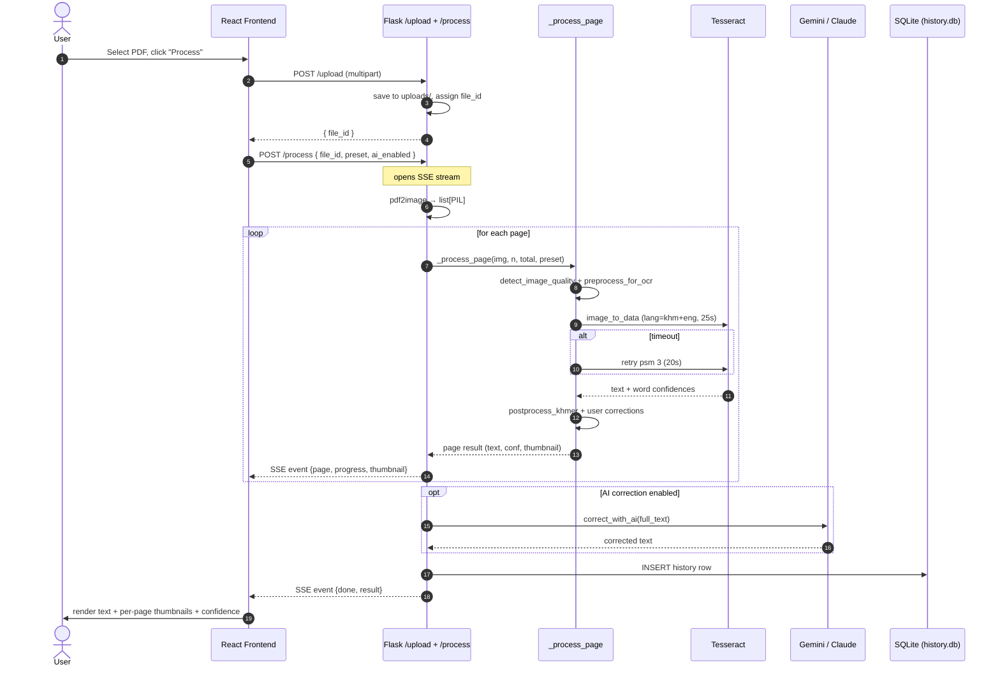

# Khmer OCR — Project Diagrams

## 0a. Simple Linear Flow (Upload → Frontend → Tesseract → Result)

A straight left-to-right view of what happens to the file at each stage.

```mermaid
flowchart LR
    A[👤 User<br/>picks PDF] --> B[🌐 React Frontend<br/>UploadSection]
    B -->|POST /upload<br/>multipart form| C[🐍 Flask Backend<br/>saves to uploads/]
    C -->|file_id| D[📄 pdf2image<br/>PDF → pages @ 300 DPI]
    D --> E[🖼️ Image Preprocessing<br/>denoise · CLAHE · sharpen · binarize · deskew]
    E --> F[🔤 Tesseract OCR<br/>lang: khm+eng<br/>--oem 1 --psm 4]
    F --> G[🧹 Postprocess<br/>Khmer cleanup<br/>+ user corrections]
    G --> H{AI correction?}
    H -->|yes| I[🤖 Gemini / Claude<br/>fix remaining errors]
    H -->|no|  J
    I --> J[💾 Save to history.db]
    J -->|SSE stream| K[🌐 React ResultsSection<br/>text + thumbnails + confidence]
    K --> L[👤 User<br/>reads / downloads<br/>.txt or .docx]

    classDef user fill:#fff4e6,stroke:#e69500,color:#000
    classDef fe   fill:#e6f2ff,stroke:#1f6feb,color:#000
    classDef be   fill:#e6f9ec,stroke:#2da44e,color:#000
    classDef ocr  fill:#ffe6e6,stroke:#cf222e,color:#000
    classDef ai   fill:#f3e8ff,stroke:#8250df,color:#000
    class A,L user
    class B,K fe
    class C,D,E,G,J be
    class F ocr
    class I ai
```

---

## 0. End-to-End Flow (User → Frontend → Backend → Result)

High-level journey of a PDF from the user's screen to extracted Khmer text.

```mermaid
flowchart TB
    subgraph USER["👤  User"]
        U1[Opens website<br/>localhost:5001]
        U2[Drags / picks PDF]
        U3[Adjusts settings<br/>preset, AI on/off]
        U4[Clicks 'Process']
        U5[Watches live progress]
        U6[Reads / downloads result]
    end

    subgraph FE["🌐  Frontend (React SPA)"]
        F1[UploadSection<br/>validates file type & size]
        F2[SettingsSection<br/>preset + AI provider]
        F3[POST /upload<br/>multipart form]
        F4[POST /process<br/>opens SSE stream]
        F5[ProgressSection<br/>page-by-page updates]
        F6[ResultsSection<br/>text + thumbnails + confidence]
        F7[HistorySection<br/>past extractions]
    end

    subgraph BE["🐍  Backend (Flask, port 5001)"]
        B1[/upload route<br/>saves file → uploads/<br/>returns file_id/]
        B2[/process route<br/>SSE generator/]
        B3[pdf2image<br/>PDF → PIL pages @ 300 DPI]
        B4[Per-page loop<br/>preprocess → Tesseract → postprocess]
        B5{AI correction?}
        B6[Gemini / Claude API call]
        B7[Save to history.db]
        B8[Stream final result]
    end

    subgraph OUT["📦  Output"]
        O1[Plain text]
        O2[.docx download]
        O3[Per-page thumbnails]
        O4[Word confidence scores]
        O5[History entry]
    end

    U1 --> U2 --> U3 --> U4
    U3 -. settings .-> F2
    U2 --> F1
    F1 --> F3 --> B1
    B1 -. file_id .-> F3
    F4 --> B2
    B2 --> B3 --> B4
    B4 -- SSE event per page --> F5
    F5 --> U5
    B4 --> B5
    B5 -->|yes| B6 --> B7
    B5 -->|no|  B7
    B7 --> B8 --> F6
    F6 --> O1 & O2 & O3 & O4
    B7 --> O5 --> F7
    F6 --> U6

    classDef userBox  fill:#fff4e6,stroke:#e69500,color:#000
    classDef feBox    fill:#e6f2ff,stroke:#1f6feb,color:#000
    classDef beBox    fill:#e6f9ec,stroke:#2da44e,color:#000
    classDef outBox   fill:#f3e8ff,stroke:#8250df,color:#000
    class U1,U2,U3,U4,U5,U6 userBox
    class F1,F2,F3,F4,F5,F6,F7 feBox
    class B1,B2,B3,B4,B5,B6,B7,B8 beBox
    class O1,O2,O3,O4,O5 outBox
```

---

## 1. OCR Pipeline Flow

```mermaid
flowchart TD
    A([📄 Input: PDF / Image]) --> B{File Type?}
    B -->|PDF| C[pdf2image<br/>300 DPI per page]
    B -->|Image| D[PIL Image]
    C --> E[PIL Image per Page]
    D --> E

    E --> F[detect_image_quality<br/>Laplacian variance<br/>white-ratio analysis]
    F -->|clean| G1[Preset: CLEAN<br/>sharpen → Otsu → deskew]
    F -->|scan|  G2[Preset: SCAN<br/>denoise → gamma → CLAHE<br/>→ sharpen → adaptive → deskew]
    F -->|photo| G3[Preset: PHOTO<br/>bilateral → gamma → CLAHE<br/>→ sharpen → Otsu → deskew]

    G1 --> H[Tesseract OCR<br/>--oem 1 --psm 4<br/>lang: khm+eng<br/>timeout: 25s]
    G2 --> H
    G3 --> H

    H -->|timeout fallback| H2[Tesseract Retry<br/>--oem 1 --psm 3<br/>timeout: 20s]
    H  --> I[image_to_data<br/>word confidence scores]
    H2 --> I

    I --> J[postprocess_khmer<br/>form-blank detection<br/>line cleanup<br/>Khmer char corrections<br/>symbol cleanup]

    J --> K[apply_user_corrections<br/>custom dictionary]

    K --> S[Suspicious-word detection<br/>difflib unchanged ∩ conf < 45]

    S --> L{AI Correction<br/>enabled?}
    L -->|Yes, Gemini| M1[Google Gemini API<br/>gemini-2.0-flash]
    L -->|Yes, Claude| M2[Anthropic Claude API<br/>claude-sonnet]
    L -->|No| N

    M1 --> N([📝 Output:<br/>corrected text<br/>word confidences<br/>page thumbnail])
    M2 --> N
```

---

## 2. System Architecture



---

## 3. Request Sequence (PDF Upload → Result)


